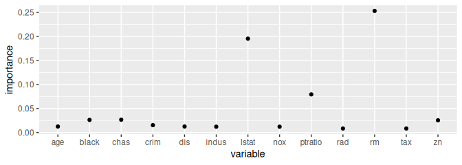

<!-- README.md is generated from README.Rmd. Please edit that file -->

# partim

<!-- badges: start -->


<!-- badges: end -->

`partim` is an `R` package to compute model-agnostic relative importance
for linear and nonlinear regression models using a graph partitioning
approach that approximates Shapley regression values. The **relative
importance** of features in a regression measures the **contribution of
each feature to the model prediction**. When the goodness-of-fit of a
model is measured using $R^2$ (i.e. the percentage of target variance
explained by the model), then meaningful importance values should
provide an additive decomposition of $R^2$, such that a feature’s
importance represents that feature’s percentage of target variance
explained.

The most theoretically sound approach to decomposing explained variance
in a linear regression is the Shapley regression (typically referred to
as “LMG” in `R` packages that implement the technique[^1]). However, the
LMG method is computationally complex with an $\mathcal{O}(2^k)$ runtime
where $k$ is the number of features. Furthermore, LMG is limited to the
*linear* regression context with no implementation for regularized or
nonlinear models available in `R` (to the author’s knowledge).

This package makes two contributions:

1.  It provides a fast approximation of LMG that uses graph partitioning
    with an $\mathcal{O}(k^2)$ runtime
2.  It is generalizable to nonlinear and regularized regression models

The proposed approach reduces the dimensionality of the model-space
using hierarchical clustering and graph-corrected nested coalition
Shapley values for each feature.

## Installation

`partim` can be installed from
[Github](https://github.com/jpfitzinger/partim) with:

``` r
# Dev version
# install.packages("devtools")
devtools::install_github("jpfitzinger/partim")
library(partim)
```

## Overview and usage

The `partim` function computes importance values and can take `formula`
and `data` arguments or `x` and `y` arguments:

``` r
# formula syntax
data <- MASS::Boston
imp <- partim(medv ~ ., data)

# ---- OR ----

# 'x' and 'y' syntax
x <- data[, 1:13]
y <- data[, 14]
imp <- partim(x, y)
```

`partim` recursively splits the features (`x`) into clusters and
allocates importance to each cluster using one of 3 available methods
(see [Methodology](#methodology) for a more detailed discussion):

1.  `method = "tree_entropy"` (the default) is a graph-based
    approximation of the Shapley regression (LMG importance) but adjusts
    for unbalanced tree structures using the entropy of common component
    loadings in the clusters. The approach is equal to `tree_lmg` when a
    balanced hierarchical graph is used.
2.  `method = "tree_lmg"` is a direct graph-based approximation of the
    Shapley regression without adjustments. It consequently works best
    with balanced trees.
3.  `method = "tree_pmvd"` is a graph-based approximation of the
    “proportional marginal variance decomposition” (PMVD) approach
    (Feldman 2005).

## Methodology

The Shapley regression calculates the importance of the $i \text{th}$
feature, $\gamma_i$, by fitting a linear regression of the dependent
variable $y$ on every possible subset of features and computing the
average increase in $R^2$ achieved by adding feature $i$ to each subset
that excludes $i$. This approach is feasible only for small values of
$k$.

Partition importance reduces the dimensionality of the problem by
calculating recursive coalition importance values for the predicted
values $\hat{y}$. Suppose a regression is estimated such that

$$
\hat{y} = \mathcal{f}(\mathbf{x}),
$$

where $\mathcal{f}(\cdot)$ is an arbitrary linear or nonlinear function,
and $\mathbf{x}$ is an $n\times k$ matrix of features.

Now let $\mathbb{A}^i_{\ell} \in \lbrace1,...,k\rbrace$ be a set that
contains $i$ and is the $\ell\text{th}$ node in a hierarchical graph of
the features. For instance, if $k=8$,
$\mathbb{A}^1 = \lbrace\mathbb{A}^1_j\rbrace$ could be given by

$$
\mathbb{A}^1 = 
\begin{cases}
\mathbb{A}^1_0 : \lbrace1,2,3,4,5,6,7,8\rbrace\\
\mathbb{A}^1_1 : \lbrace1,2,3,4\rbrace\\
\mathbb{A}^1_2 : \lbrace1,2\rbrace\\
\mathbb{A}^1_3 : \lbrace1\rbrace
\end{cases}
$$

Furthermore, let $\mathbb{B}^i_{\ell}$ be the complementary set at each
level in the hierarchy defined as
$\mathbb{A}^i_{\ell-1}\setminus\mathbb{A}^i_{\ell}$, so that

$$
\mathbb{B}^1 = 
\begin{cases}
\mathbb{B}^1_0 : \lbrace\rbrace\\
\mathbb{B}^1_1 : \lbrace5,6,7,8\rbrace\\
\mathbb{B}^1_2 : \lbrace3,4\rbrace\\
\mathbb{B}^1_3 : \lbrace2\rbrace
\end{cases}
$$

At the $\ell$th level, the importance of features $\mathbb{A}^i_\ell$ is
computed using the $R^2$ of a regression of $\hat{y}_\ell^a$ on
$\mathbf{x}_a$, where $\mathbf{x}_a$ is shorthand to denote a matrix of
$\lbrace1,...,k\rbrace\setminus \mathbb{B}_\ell^a$ feature values and
$\hat{y}_\ell^a$ is defined below. Let this $R^2$ be denoted by
$r_\ell^a$.

Now the importance of features $\mathbb{A}^i_\ell$ is given by

$$
\gamma^a_\ell = \omega r_\ell^a + (1-\omega) (1 - r_\ell^b).
$$

$\hat{y}_\ell^a$ is defined to ensure that
$\gamma_\ell^a + \gamma_\ell^b = 1$, by setting

$$
\hat{y}_\ell^a = \omega \mathcal{f}(\mathbf{x}_a) + (1 - \omega)(\hat{y}_{\ell-1}^a - \mathcal{f}(\mathbf{x}_b)).
$$

$\omega$ is the weight that allocates the common variation of
$\mathbf{x}_a$ and $\mathbf{x}_b$ between the importance values. In the
case of the Shapley regression, $\omega = 0.5$, while in the case of
PMVD $\omega = \frac{1-r_\ell^b}{2-r_\ell^a-r_\ell^b}$.

## Custom clustering

How features are split into clusters can be controlled using the
`splitter` argument. This argument takes a function that has a single
input `x` and returns a vector of cluster allocations. `partim` provides
an example wrapper method called `fSplit`, which facilitates
pre-packaged correlation-based clustering with the `cluster` package
(Maechler et al. 2022):

``` r
# A balanced single-linkage tree
splt <- fSplit(type = "agnes", method = "single", balanced = TRUE)
imp_sl <- partim(medv ~ ., data, method = "tree_lmg", splitter = splt)

# Correlation-based Divisive Analysis (the default)
splt <- fSplit(type = "diana")
imp_da <- partim(medv ~ ., data, splitter = splt)

# Partitioning around medoids
splt <- fSplit(type = "pam")
imp_pam <- partim(medv ~ ., data, splitter = splt)
```

As seen on the plot below, the choice of clustering algorithms can have
a marked impact on the importance values when data are correlated.
Generally, the divisive analysis (`diana`) algorithm has been observed
to yield the most robust results.

``` r
library(ggplot2)

plot_data <- dplyr::tibble(
  variable = colnames(x),
  `single linkage` = imp_sl,
  diana = imp_da,
  pam = imp_pam)

plot_data |> 
  tidyr::gather("method", "importance", -variable) |> 
  ggplot(aes(x = variable)) +
  geom_point(aes(y = importance, color = method)) +
  theme(legend.position = "top")
```


## Custom model fitting

Partition importance explains **fitted variance** instead of the target
variable directly. Since 100% of the fitted variance is explained by the
model, the decomposition is recursively performed along a tree with the
relative importance values summing to one at each split. The product of
each branch’s importance yields feature-level importance values that can
be used to decompose the fitted model $R^2$ among the features.

Explaining fitted values also makes the approach model-agnostic.
Arbitrary model fitting methods can customized using the `fEstimate`
argument. The argument takes a function that has `x` and `y` inputs and
returns an object with a `fitted.values` attribute. Examples are
`stats::lm.fit`, `stats::lm.wfit` or `stats::rlm`. Once again, the
package provides a convenience wrapper for `lm`, `glmnet` and `nnet`
functions.

In the example below, an elastic net regression is fitted and explained
using the `tree_pmvd` method:

``` r
est <- fEstimate(type = "glmnet", alpha = 0.5, lambda = 1)
imp <- partim(medv ~ ., data, method = "tree_pmvd", fEstimate = est)

qplot(colnames(x), imp, xlab = "variable", ylab = "importance")
```



It is important to note that when explaining a regularized regression
using the regularized method itself, the resulting importance values
will be regularized (and hence biased). In most cases, therefore, the
model used to allocate importance values at the splits should be more
flexible than the model used for fitting. `partim` accommodates this by
allowing a separate fitting function to be passed to `fExplain`:

``` r
imp <- partim(medv ~ ., data, method = "tree_pmvd", fEstimate = est, fExplain = lm.fit)
qplot(colnames(x), imp, xlab = "variable", ylab = "importance")
```


## Nonlinear regression

`partim` can also be used in nonlinear regressions. This is interesting
since it provides a method for measuring (global) importance in black
box algorithms that accounts for feature dependence within an $R^2$
decomposition framework. To illustrate, I simulate a very simple
nonlinear problem:

``` r
set.seed(123)
# Four features, two of which represent noise
x <- matrix(rnorm(4*500), 500)
# Target variable with nonlinear DGP
y <- 
  x[,1] * ifelse(x[,1] > 0, -2, 2) + 
  x[,2] * ifelse(x[,2] > 0, -2, 2) + 
  rnorm(500)

# Linear importance
imp_lin <- partim(x, y)
# Nonlinear neural net importance
imp_nn <- partim(x, y, fEstimate = fEstimate("nnet", size=4, maxit=1000))

plot_data <- dplyr::tibble(
  variable = names(imp_lin),
  linear = imp_lin,
  nonlinear = imp_nn)

plot_data |> 
  tidyr::gather("method", "importance", -variable) |> 
  ggplot(aes(x = variable)) +
  geom_point(aes(y = importance, color = method)) +
  theme(legend.position = "top")
```


The plot shows that (unsurprisingly) the linear regression is unable to
capture the nonlinear effect, while the neural network captures it
correctly, explaining a total of (just under) 80% of the variance in
`y`.

<div id="refs" class="references csl-bib-body hanging-indent">

<div id="ref-feldman_relative_2005" class="csl-entry">

Feldman, Barry. 2005. “Relative Importance and Value.”

</div>

<div id="ref-relaimpo" class="csl-entry">

Groemping, Ulrike. 2006. “Relative Importance for Linear Regression in
r: The Package Relaimpo.” *Journal of Statistical Software* 17 (1):
1–27.

</div>

<div id="ref-sensitivity" class="csl-entry">

Iooss, Bertrand, Sebastien Da Veiga, Alexandre Janon, Gilles Pujol, with
contributions from Baptiste Broto, Khalid Boumhaout, Laura Clouvel, et
al. 2024. *Sensitivity: Global Sensitivity Analysis of Model Outputs and
Importance Measures*. <https://CRAN.R-project.org/package=sensitivity>.

</div>

<div id="ref-lindeman_introduction_1980" class="csl-entry">

Lindeman, Richard Harold, Peter Francis Merenda, and Ruth Z. Gold. 1980.
*Introduction to Bivariate and Multivariate Analysis*. Glenview, Ill:
Scott, Foresman.

</div>

<div id="ref-cluster" class="csl-entry">

Maechler, Martin, Peter Rousseeuw, Anja Struyf, Mia Hubert, and Kurt
Hornik. 2022. *Cluster: Cluster Analysis Basics and Extensions*.
<https://CRAN.R-project.org/package=cluster>.

</div>

</div>

[^1]: LMG is an acronym of the first letter of the authors’ surnames,
    see Lindeman, Merenda, and Gold (1980). `R` packages implementing
    the LMG method include `relaimpo` (Groemping 2006) and `sensitivity`
    (Iooss et al. 2024).
